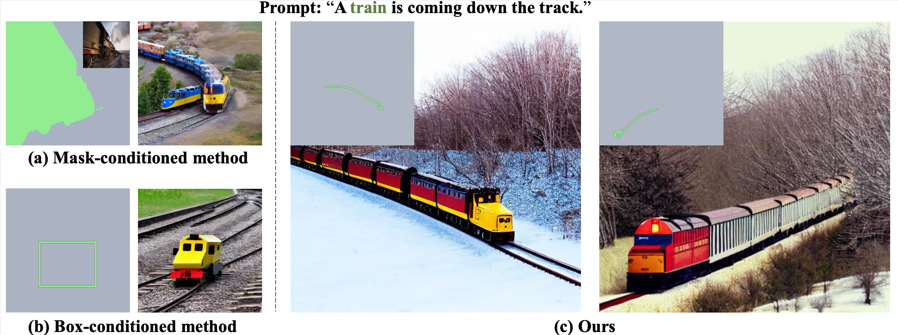
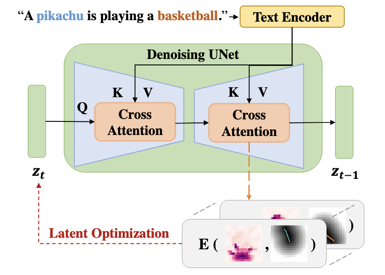

# TraDiffusion：Trajectory-Based Training-Free Image Generation

The repo is for the paper TraDiffusion: Trajectory-Based Training-Free Image Generation.We also provide a [Quick Start guide](#quick-start) and a [Gradio demo](#gradio-demo) to help you quickly get started with this project.



We introduce a training-free, trajectory-based controllable Text-to-Image (T2I) approach called TraDiffusion. This novel method allows users to effortlessly guide image generation using mouse trajectories, in contrast to traditional methods that rely on boxes or masks. TraDiffusion leverages the Distance Awareness energy function, effectively guiding latent variables to ensure that the generation is concentrated within the areas defined by the trajectory. We also compare TraDiffusion with traditional box-conditioned and mask-conditioned methods. The results demonstrate that TraDiffusion enables simpler, more natural image control. Additionally, we showcase its ability to manipulate salient regions, attributes, and relationships within the generated images, based on arbitrary or enhanced trajectories.

## Model Overview

TraDiffusion uses a pretrained diffusion model and implements a Distance Awareness energy function combined with trajectories to achieve training-free layout control.

Please check our [paper]() for more details.

## Quick Start 

### Environment Setup

You can easily set up a environment according to the following command:
```buildoutcfg
conda create -n traces-guidance python=3.8
conda activate traces-guidance
pip install -r requirements.txt
```

### Inference

We provide an example in `inference,py`. The corresponding information will saved in path `./example_output`.  Detail configuration can be found in the `./conf/base_config.yaml` and `inference.py`. You can quickly use with the following commands:
```buildoutcfg
python inference.py general.save_path=./example_output 
```

### Gradio Demo
We also provide a gradio project that you can quickly use with the following commands:
```buildoutcfg
python inference_gradio.py 
```
Here we provide an example of using a Gradio program.


## 
