# TraDiffusion：Trajectory-Based Training-Free Image Generation

This document will showcase additional results of TraDiffusion, including [control over salient area](#control-over-salient-area), [arbitrary trajectory control](#arbitrary-trajectory-control), [target attribute and relationship control](#target-attribute-and-relationship-control), [additional visual input control](#additional-visual-input-control), [control with different random seeds](#control-with-different-random-seeds), and [comparisons with other models](#comparisons-with-other-models).

Please check our 🔥[paper](https://arxiv.org/abs/2408.09739) for ablation study and more details.

## Control Over Salient Area

Examples of controlling the salient area of the targets with trajectories. We can adjust the position of the local salient area of the object by enhancing the local trajectory.

  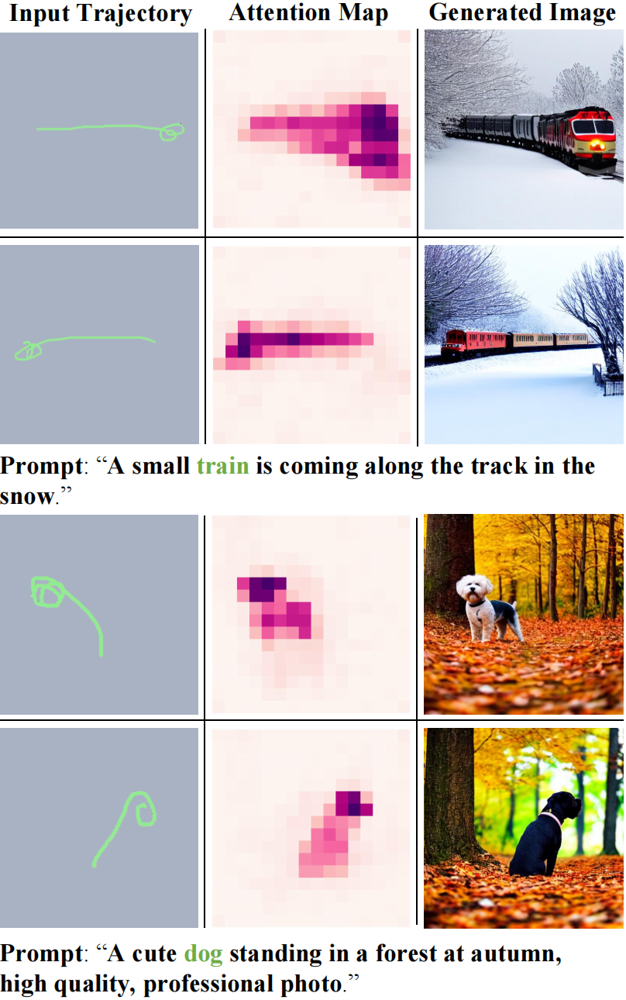

## Arbitrary Trajectory Control

Examples of controlling the object with arbitrary trajectories. We can adjust the posture of the target (top) or specify the approximate shape of the target (bottom) by varying the given trajectory.

  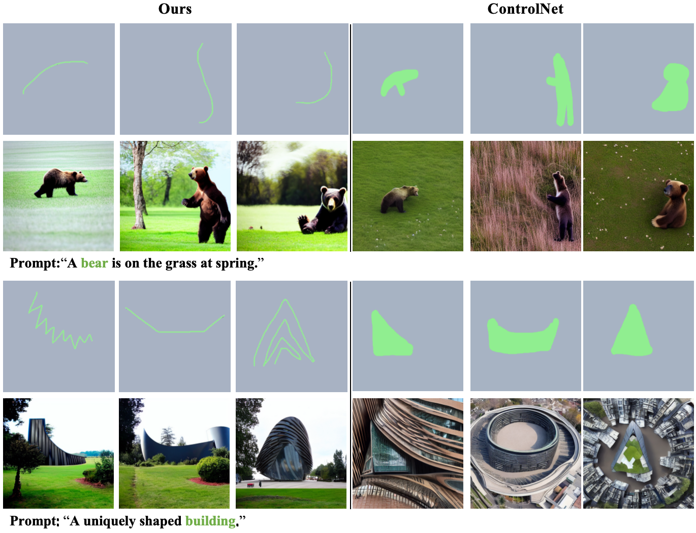

### Comparison of Trajectory and Mask Brush
We use a thicker brush to draw the mask for a fairer time-based comparison with the trajectory condition. However, the results show that the final output is less than ideal. This suggests that using masks as an additional condition requires finer detailing of the target, which not only takes more time but is also less user-friendly compared to trajectory conditions.

## Target Attribute And Relationship Control

Examples of controlling the attribute and relationship of the targets. Based on trajectories, we can overcome the attribute confusion issue of the pre-trained stable diffusion model, generating visual results consistent with the given prompt (a), and adjust the positions of interactions (b).

  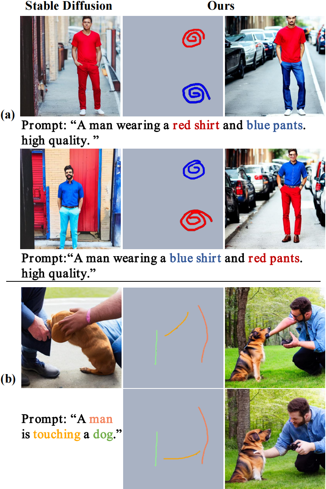

## Additional Visual Input Control

Examples of controlling the visual input.

  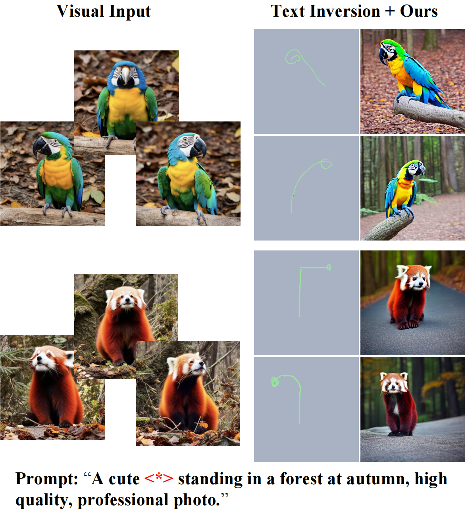

## Control With Different Random Seeds

Examples with different random seeds. Our method can reliably achieve control over the targ

  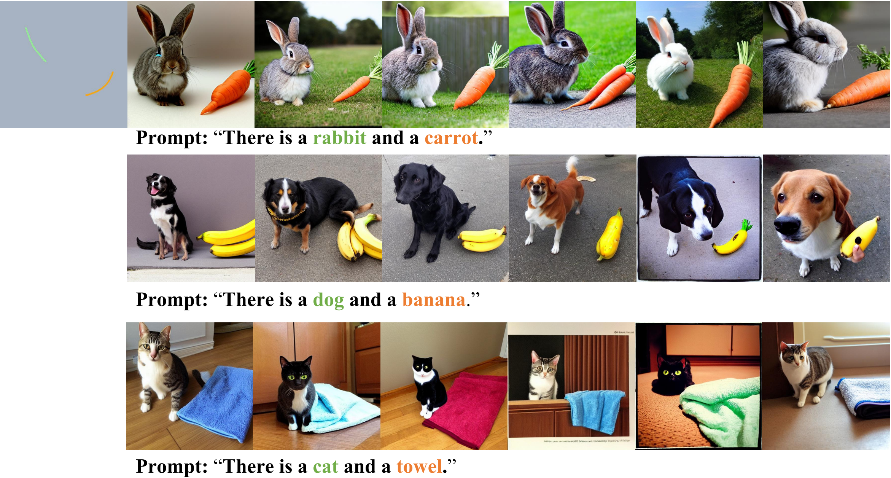

## Comparisons With Other Models

Qualitative comparison with prior mask-based and box-based layout control works. The controlled targets are colored with green and orange. The mask-based and box-based layout control methods generate the unnatural images due to the control conditions that are too fine or too coarse. However, our simple trajectory-based approach yields more natural results.

  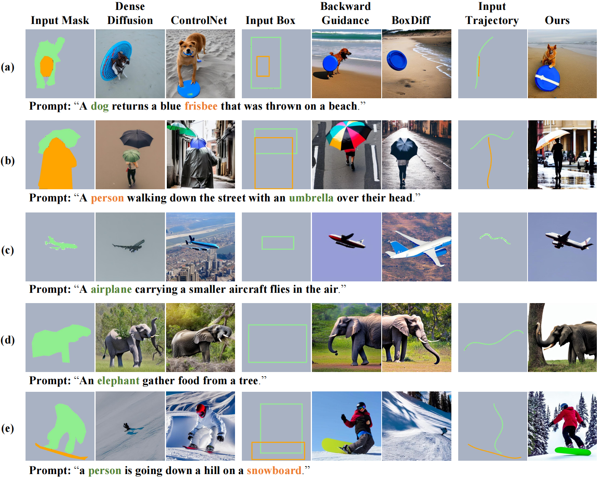

  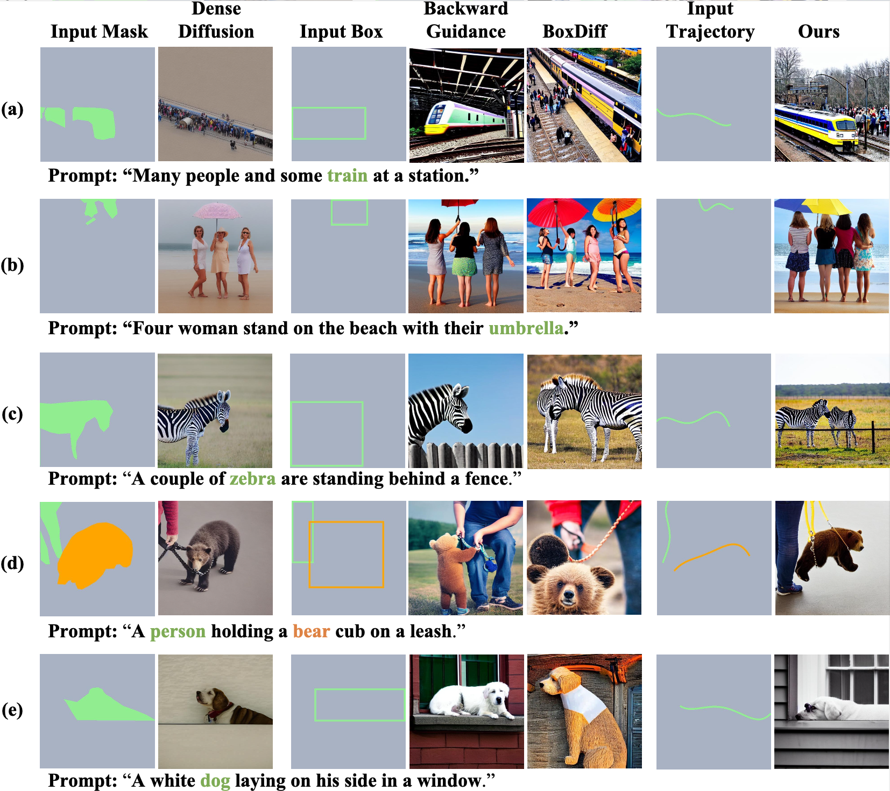

Comparing with ControlNet Scribble(middle and right). We observe that ControlNet with scribble essentially remainsa mask-based method, as it cannot be effectively controlled using overly simplistic scribbl

  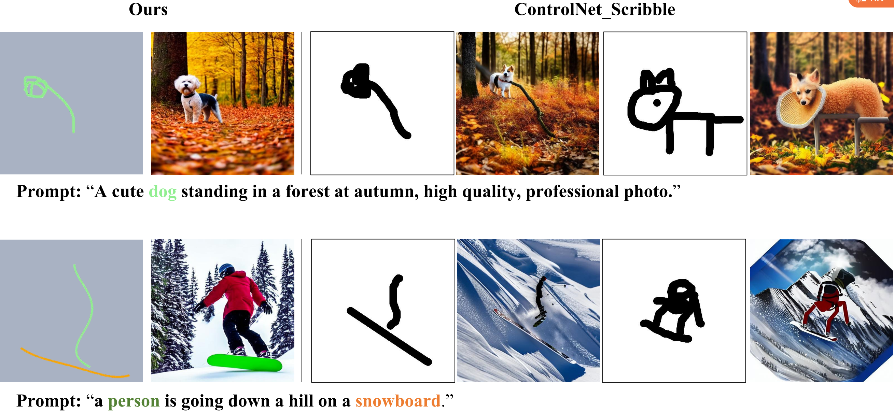

Comparing with InstanceDiffusion Scribble (right). We observe that InstanceDiffusion with scribble essentially re-mains a point-based method, it fails to align the generated targets with the provided scribble poi

  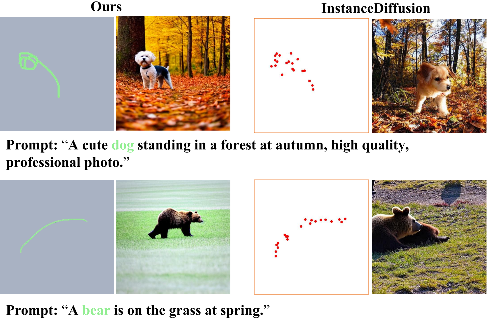

Comparing with pretrained Stable Diffusion model. Our method can guide Stable Diffusion model to generate multiple targets, despite the inherent limitations of the Stable Diffusion model in this regard

  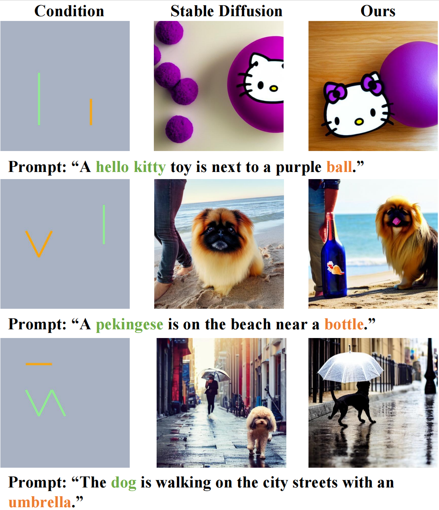

## The Situation of Trajectory Overlap

Examples of trajectory overlap situations.

  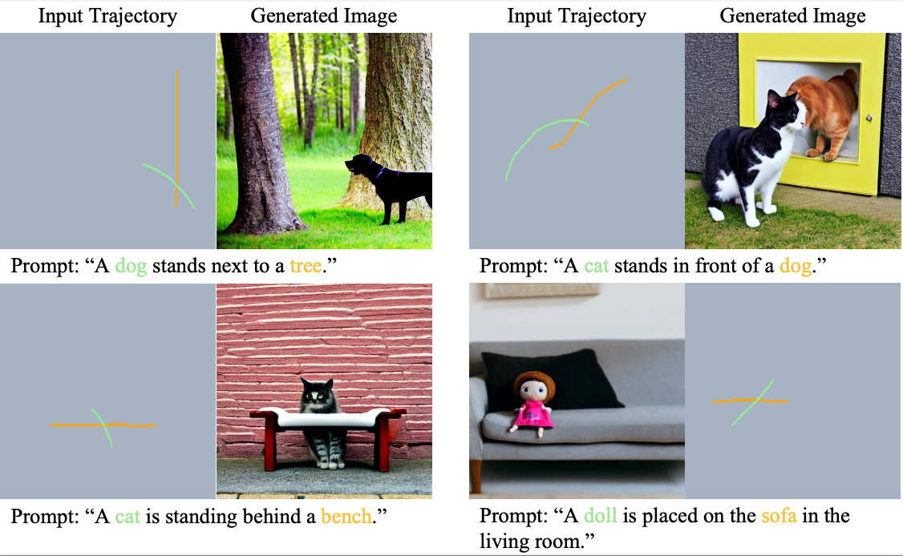

